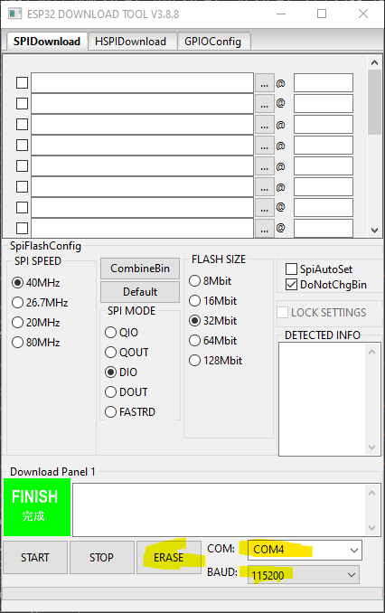
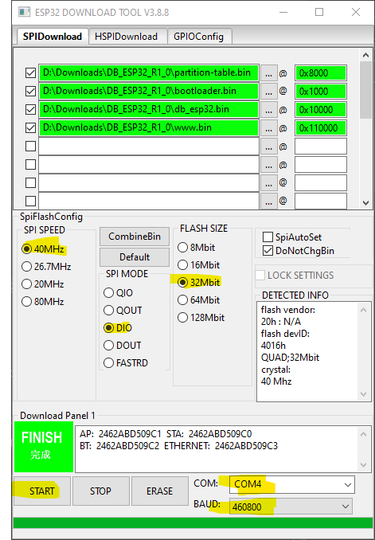
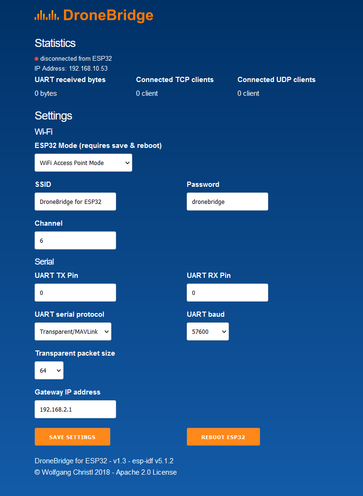

# DroneBridge for ESP32
DroneBridge enabled firmware for the popular ESP32 modules from Espressif Systems. Probably the cheapest way to
communicate with your drone, UAV, UAS, ground based vehicle or whatever you may call them.

Also allows for a fully transparent serial to wifi pass through with variable packet size
(Continuous stream of data required).

DroneBridge for ESP32 is a telemetry/low data rate only solution. There is no support for cameras connected to the ESP32 since it does not support video encoding.


## Features
-   Bi-directional link: MAVLink, MSP & LTM
-   Affordable: ~7€
-   Up to 150m range
-   Weight: <10 g
-   Supported by: DroneBridge for Android (app), mwptools, QGroundControl, impload etc.
-   Easy to set up: Power connection + UART connection to flight controller
-   Fully configurable through easy to use web interface
-   Parsing of LTM & MSPv2 for more reliable connection and less packet loss
-   Fully transparent telemetry downlink option for continuous streams like MAVLink or and other protocol
-   Reliable, low latency, light weight
-   Upload mission etc.


Tested with: DOIT ESP32 module


Blackbox concept. UDP & TCP connections possible. Automatic UDP uni-cast of messages to port 14550 to all 
connected devices/stations. Allows additional clients to register for UDP. Client must send a packet with length > 0 to UDP port of ESP32.

## Installation/Flashing using precompiled binaries

First download the latest release from this repository.
[You can find them here](https://github.com/DroneBridge/ESP32/releases).

For flashing there are many ways of doing this. To easy ones are shown below.

**Erase the flash before flashing a new release!**

#### All platforms: Use Espressif firmware flashing tool

#### Recommended

1.  [Download the esp-idf for windows](https://docs.espressif.com/projects/esp-idf/en/release-v4.3/esp32/get-started/windows-setup.html#get-started-windows-tools-installer) or [linux](https://docs.espressif.com/projects/esp-idf/en/release-v4.3/esp32/get-started/linux-setup.html) or install via `pip install esptool`
2.  Connect via USB/Serial. Find out the serial port via `dmesg` on linux or device manager on windows.
  In this example the serial connection to the ESP32 is on `COM4` (in Linux e.g. `/dev/ttyUSB0`).
3. `esptool.py -p COM4 erase_flash`
4. ```shell
   esptool.py -p COM4 -b 460800 --before default_reset --after hard_reset --chip esp32  write_flash --flash_mode dio --flash_size detect --flash_freq 40m 0x1000 bootloader.bin 0x8000 partition-table.bin 0x10000 db_esp32.bin 0x110000 www.bin
   ```
   You might need to press the boot button on your ESP to start the upload/flash process.

[Look here for more detailed information](https://github.com/espressif/esptool)

#### Windows only: Use flash download tools

1. [Get it here](https://www.espressif.com/en/support/download/other-tools?5)
2. Erase the flash of the ESP32 befor flashing a new release\
   
3. Select the firmware, bootloader & partition table and set everything as below
   ```shell
    0x8000 partition_table/partition-table.bin
    0x1000 bootloader/bootloader.bin
    0x10000 db_esp32.bin
    0x110000 www.bin
   ```
   
3.  Hit Start and power cycle your ESP32 after flashing

### Wiring

1.  Connect UART of ESP32 to a 3.3V UART of your flight controller.
2.  Set the flight controller port to the desired protocol.

(Power the ESP32 module with a stable 5-12V power source) **Check out manufacturer datasheet! Only some modules can
take more than 3.3V/5V on VIN PIN**

Defaults: UART2 (RX2, TX2 on GPIO 16, 17)

### Configuration
1.  Connect to the wifi `DroneBridge ESP32` with password `dronebridge`
2.  In your browser type: `dronebridge.local` (Chrome: `http://dronebridge.local`) or `192.168.2.1` into the address bar.
 **You might need to disable the cellular connection to force the browser to use the wifi connection**
3.  Configure as you please and hit `save`



**Configuration Options:**
-   `Wifi SSID`: Up to 31 character long
-   `Wifi password`: Up to 63 character long
-   `UART baud rate`: Same as you configured on your flight controller
-   `GPIO TX PIN Number` & `GPIO RX PIN Number`: The pins you want to use for TX & RX (UART). See pin out of manufacturer of your ESP32 device **Flight controller UART must be 3.3V or use an inverter.**
-   `UART serial protocol`: MultiWii based or MAVLink based - configures the parser
-   `Transparent packet size`: Only used with 'serial protocol' set to transparent. Length of UDP packets
-   `LTM frames per packet`: Buffer the specified number of packets and send them at once in one packet
-   `Gateway IP address`: IPv4 address you want the ESP32 access point to have

Most options require a restart/reset of ESP32 module

## Use with DroneBridge for Android or QGroundControl


-   Use the Android app to display live telemetry data. Mission planning capabilities for MAVLink will follow.
-   The ESP will auto broadcast messages to all connected devices via UDP to port 14550. QGroundControl should auto connect
-   Connect via **TCP on port 5760** or **UDP on port 14550** to the ESP32 to send & receive data with a GCS of your choice. **In case of a UDP connection the GCS must send at least one packet (e.g. MAVLink heart beat etc.) to the UDP port of the ESP32 to register as an end point.**

## Developers

### Compile
 You will need the Espressif SDK: esp-idf + toolchain. Check out their website for more info and on how to set it up.
 The code is written in pure C using the esp-idf (no arduino libs).

 **This project uses the v4.3 branch of ESP-IDF**

 Compile and flash by running: `idf.py build`, `idf.py flash`

 ### API
The webinterface communicates with a REST:API on the ESP32. You can use that API to set configurations not selectable 
via the web-interface (e.g. baud rate). It also allows you to easily integrate DroneBridge for ESP32.


**To request the settings**
```http request
http://dronebridge.local/api/settings/request
```

**To request stats**
```http request
http://dronebridge.local/api/system/stats
```

**Trigger a reboot**
```http request
http://dronebridge.local/api/system/reboot
```

**Trigger a settings change:** Send a valid JSON
```json
{
  "wifi_ssid": "DroneBridge ESP32",
  "wifi_pass": "dronebridge",
  "ap_channel": 6,
  "tx_pin": 17,
  "rx_pin": 16,
  "telem_proto": 4,
  "baud": 115200,
  "msp_ltm_port": 0,
  "ltm_pp": 2,
  "trans_pack_size": 64,
  "ap_ip": "192.168.2.1"
}
```
to
```http request
http://dronebridge.local/api/settings/change
```

 ### Testing
 To test the frontend without the ESP32 run 

 ```sh
 npm install -g json-server
 json-server db.json --routes routes.json
 ```
Set `const ROOT_URL = "http://localhost:3000/"` inside `frontend/db_settings.js`
